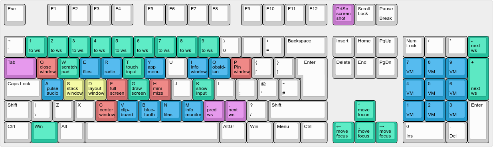
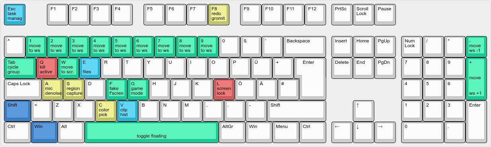

# dots-hyprland

  

|                                                                                 |                                                                                 |
| :-----------------------------------------------------------------------------: | :-----------------------------------------------------------------------------: |
|              |  | 
|  |  | 
|    |  | 

This is a collection for an arch linux + btrfs + hyperland setup.

This is inspired from arcolinux b iso of hyperland.

The required packages are listed in requirements.txt

### How to use / install
1) Install Arch Linux (I used Arco-linux-b hyprland iso with basic install using btrfs)
  - Use **btrfs** as partition scheme
2) Install Depedencies from `requirements.txt` e.g. via `pacman`: `pacman -S - < requirements.txt`
3) Setup `timeshift` for automatic backups (I generally use max 3 daily backups)
  - I generally do manual backups as follows: 1 after first setup `install complete`& 1 after finishing all the app-logins `setup complete` (& 1 After doing major changes and booting once with them `MAIJOR_CHANGE`)
  - Tip: remember to check that `systemctl status cronie.service` is enabled (required for timeshift intervall backups), if not run thefollowing `systemctl enable --now cronie.service`
4) Apply configurations  (before you modify anything you may want to create a **manual backup in timeshift**)
   1) Replace all `~/.config` folders (with the same name) with the folders in the git repos `/.config` folder
   2) Replace `~/.bashrc` with the provided git `/.bashrc` config
5) Setup & modify desired applications and make it your own ;)

### Misc 
If **anything goes wrong** except you kill your grub or destroy the partition you should be able to boot (from grub) directly into **btrfs snapshots**.
From there you can open timeshift and restore your system to an older snapshot. 
Remember though that if you boot into a snapshot they are still *ro*, meaning if you reboot most changes are not kept in the system.

### Things to be done
- [ ] Adding more applications
- [ ] Document install process using *archlinux* and *archinstall* for a cleaner install
  - [ ] Add universal disk encryption guide (at least for home drive) to increase the security of this setup
  - [ ] Add grub password protection guide (grub modification should use a pwd to prevent exploits e.g. boot into root shell)
  - [ ] Create image for easy insatllation via [archiso](https://wiki.archlinux.org/title/Archiso) or similar

#### PS: Tip for intel arc users
[Reddit archlinux arc a770](https://www.reddit.com/r/archlinux/comments/15kiemw/beginners_guide_to_using_intel_arc_gpu/?rdt=60196)

Packages to support functionality: 
- `yay -R xf86-video-intel`
- `yay -S intel-media-driver vulkan-intel lib32-vulkan-intel linux-firmware`
- `yay -S intel-gpu-tools`

"New" intel drivers (experimental, meay work better or worse)
 - `sudo lspci -v | grep -A 15 VGA` ~ check what driver you are using (xe is the "new" driver)
 - `lspci -nn | grep VGA` ~ Get your graphics card id (e.g. '56a0')
 - `GRUB_CMDLINE_LINUX="i915.force_probe=!56a0 xe.force_probe=56a0"` ~ Use `xe` driver by default
